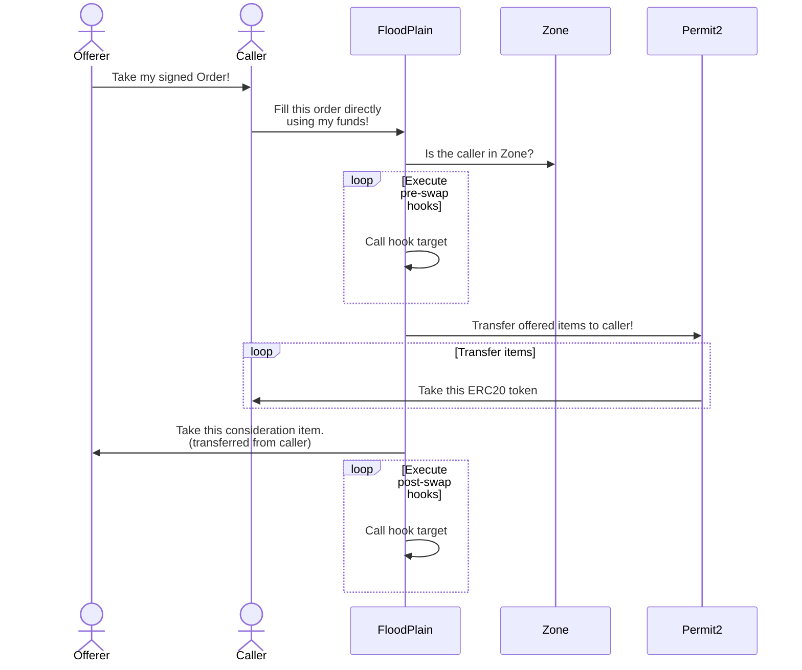
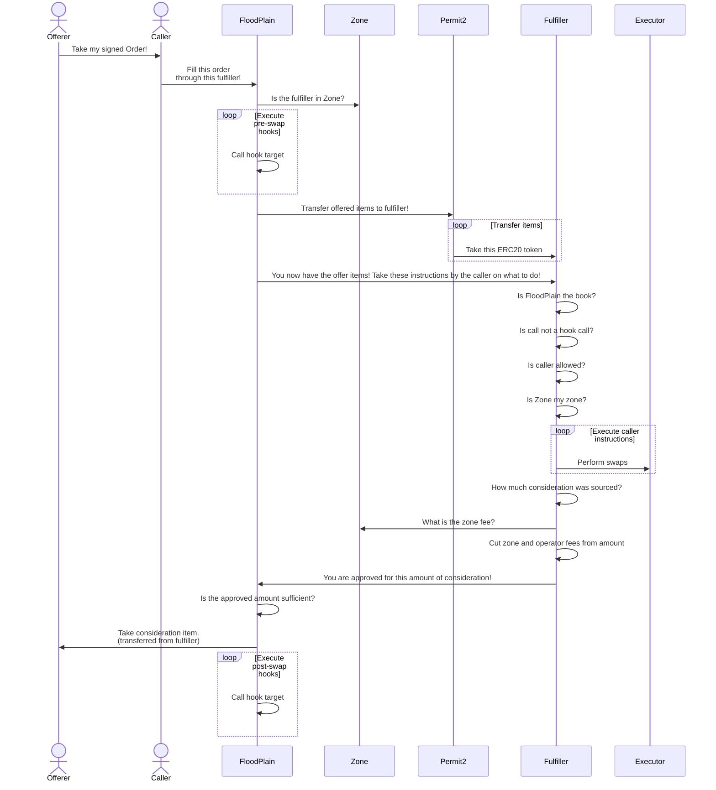
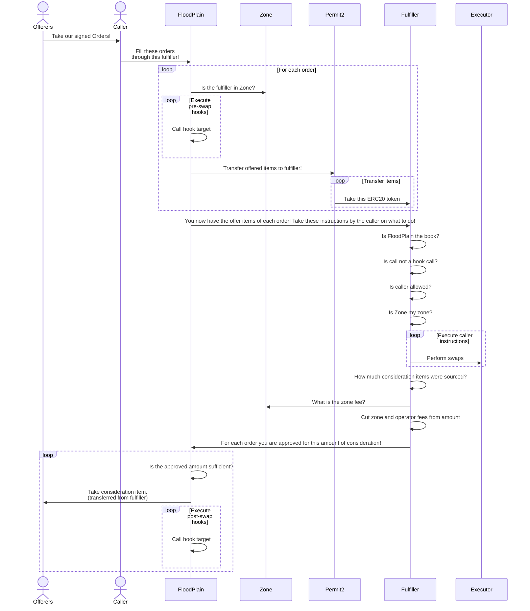

# Flood

## Actors

There are three actors in Flood ecosystem: Offerers, fulfillers, and zones.

* Offerer: An offerer signs off-chain order that gets filled by a fulfiller.
* Fulfiller: Takes an order and submits an on-chain transaction to fulfill it.
* Zone: A zone is a collection of fulfillers.

## FloodPlain (Book)

FloodPlain is an order book which allows fulfillment of orders through arbitrary execution.

A FloodPlain order has an arbitrary amount of ERC20 offer items and a single consideration item. Offer items are what the offerer (order maker) wants to give, and the consideration item is what the offerer wants to receive in return in minimum.

An order is a single Permit2 signature which includes necessary token approvals and the order data. The signater verification and order cancellation features are both relegated to Permit2.

To create an order, offerer has to sign `PermitBatchWitnessTransferFrom` struct of Permit2 based on the EIP712 standard. The details of this struct can be found in the interfaces.

Note that in this structure, `witness.nonce == order.nonce`, `witness.deadline == order.deadline`, and `witness.offer == order.permitted`. This redundancy is for simplicity, because it allows Order struct to contain all the information related to an order.

The order also has Hooks and a Zone. Zone is used to enforce by whom an order can be filled. Hooks allow certain execution by FloodPlain. While executions within Fulfiller is determined by the caller, hook executions are determined by the offerer when order is signed.

After the order is signed, the order and its signature can be stored using standard Web2 solutions, or using IPFS.

Fulfilling an order requires calling `FloodPlain.fulfillOrder`. The caller may also provide a fulfiller address and the data to be passed to the fulfiller.

The `fulfiller` address is what makes FloodPlain unique. It is a special contract that takes offer items, and use those to source the consideration item in whichever way it wants. The `extraData` can be passed to the fulfiller to instruct how it should source the consideration items. Below is the execution flow of `fulfillOrder`.

1. EIP712 hash of the order is calculated
2. The fulfiller address is passed to the Zone. The Zone can choose which fulfillers are allowed.
3. Order data and the Permit2 signature are passed to Permit2 contract.
4. Permit2 performs signature validation, nonce and deadline checks, and transfers offer tokens from the offerer to the fulfiller contract.
5. `Fulfiller.sourceConsideration` is called with order details and extra arbitrary bytes as swap instructions.
6. Consideration is pulled from the Fulfiller and sent to the offerer.

Above describes a regular fulfillment operation, also called arbitrary execution fulfillment. There are three fulfillment types in total, which are described later in the document.

## Orders

All orders have nine components: Offerer, zone, recipient, offer, consideration, deadline, nonce, preHooks, and postHooks. This entire object is signed by the offerer.

* Offerer: Offerer is the address signing the order. Offerer gives offer items and receives consideration item.
* Zone: Zone is any address following IZone interface. It gives some control to offerer on who can fulfill the order.
* Recipient: The address that will receive the consideration token.
* Offer: A list of items, token and amount pairs, offerer is selling.
* Consideration: An item, token and amount pair, offerer is requesting in return. The amount in consideration is the minimum amount the offerer must receive.
* Deadline: The timestamp that the order cannot be filled after.
* Nonce: Permit2 witness nonce.
* PreHooks: A list of hooks, target and data pairs, the FloodPlain executes before transferring all items.
* PostHooks: A list of hooks, target and data pairs, the FloodPlain executes after transferring all items.

## Hooks

Hooks allow offerer to define arbitrary calls to be made by FloodPlain before and after all items are transferred. Each hook is formed by a target contract address and data to be forwarded to the address. Hooks enables extra functionality to the protocol.

The only exception to the arbitrary calls is that the target cannot be Fulfiller. Because Fulfiller is the only contract that grants certain privileges to the FloodPlain, with the assumption that FloodPlain adheres to a certain functionality. Arbitrary calls from FloodPlain would break this assumption. Given that Flood ecosystem can have multiple fulfillers, FloodPlain cannot restrict a certain address in Hooks. Instead it ensures that the hook data bytes from 4 to 31 must not clash with a certain value. This 28 bytes value, called selector extension, is always the first argument in `Fulfiller.sourceConsideration` functions. Fulfiller must ensure that this value is correct. This prevents hooks from calling `Fulfiller.sourceConsideration` functions.

## Fulfillment Types

There are three fulfillment types in FloodPlain: Direct, with execution, and batch.

### Direct fulfillment

In Direct fulfillment, fulfiller is the caller. A direct fulfillment bypasses any Zone fees.

### Arbitrary execution fulfillment

In arbitrary execution fulfillment, caller specifies a fulfiller address, and an arbitrary data to be forwarded to the fulfiller. The fulfiller then performs execution based on the instructions caller provided.

### Batch fulfillment

In batch fulfillment, offer items from multiple orders are grouped and executed together in the Fulfiller.

## EncodedCalls

`EncodedCalls` extension adds a fallback function that allows decoding of non-standard calldata. This is to minimize calldata sizes when fulfilling orders. This is desired on L2 chains, because on L2s, calldata is the primary driver of transaction costs.

Any single byte that doesn't clash with other function signatures can be used to enter the fallback. Starting from the next byte of calldata must be the Unsigned LEB128 encoded identifier of the decoder. Anyone can add a decoder to EncodedCalls contract. The index of the decoder in the decoders array is its identifier. Following the LEB128 encoded decoder identifier, remaining calldata is passed to the decoder address as staticcall. The returned data from the decoder is delegatecalled to the FloodPlain contract itself. This is logically the same as making a call with that decoded data directly.

## OnChainOrders

`OnChainOrders` extension allows submitting signed orders to chain. This simply emits an event to be used by off-chain actors.

## Known Issues

### Fee-on-tranfer Tokens

Fee-on-transfer tokens are semi-supported. If an offer item has a fee-on-transfer token, the fulfiller will receive less than the amount specified in the item. If a consideration item has a fee-on-transfer token, the offerer will receive less than the requested amount, which breaks a core invariant.

### Fulfillers with Balance

Contracts implementing Fulfiller interface could get all their tokens drained, hence they should restrict who can call them directly or indirectly.
